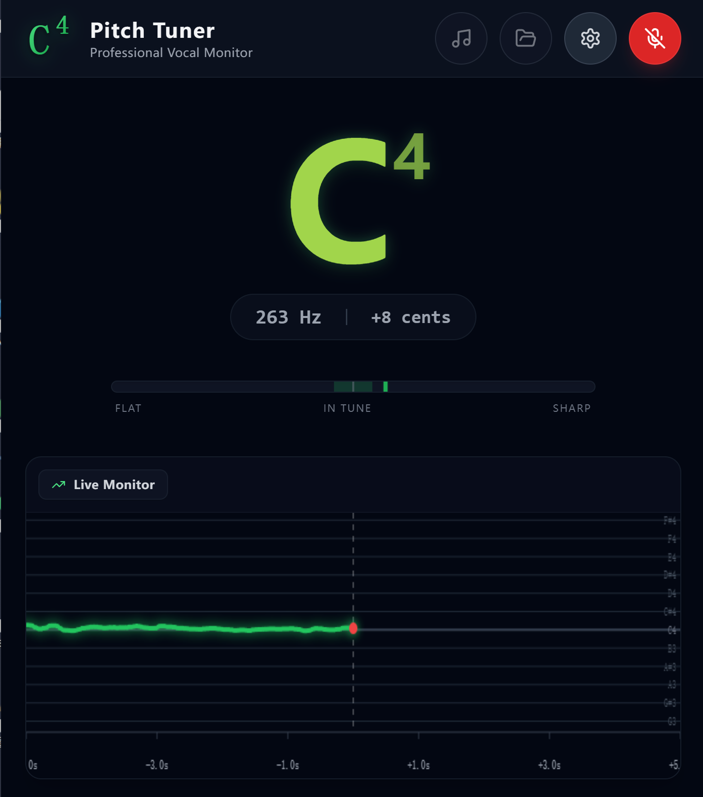

# 🎵 Pitch Tuner Pro

**Pitch Tuner Pro** 是一款基于 **Electron** 和 **React** 构建的现代化专业音调检测与音频分析桌面应用程序。

它利用 Web Audio API 的强大功能，提供高精度的实时音高追踪、音频文件离线分析以及伴奏跟唱功能，专为音乐练习者和开发者设计。



## ✨ 主要功能 (Features)

* **🎤 实时音高监测 (Real-time Monitoring)**
    * 高精度自相关算法 (Autocorrelation) 实现毫秒级音高识别。
    * 实时显示音名 (Note)、八度 (Octave)、频率 (Hz) 和音分偏差 (Cents)。
    * 可视化调音表指针，直观反馈音准。

* **📈 音频文件分析 (Audio Analysis)**
    * 支持导入多个音频文件，自动生成音高轨迹图。
    * **多轨对比**：不同音频使用不同颜色区分，方便对比原唱与录音。
    * **交互式视图**：支持时间轴的缩放 (Zoom) 和滚动 (Scroll)，查看微小细节。

* **🎶 伴奏模式 (Accompaniment Mode)**
    * 独立导入伴奏音频，仅播放不参与分析。
    * 录音时自动同步播放伴奏，适合跟唱练习。

* **🖥️ 现代化 UI 设计**
    * 基于 **Tailwind CSS** 的深色沉浸式界面。
    * 无边框窗口设计 (Frameless Window)，支持拖拽移动。
    * 完全响应式的布局，自动适配窗口大小。

* **🔧 硬件支持**
    * 自动检测并列出系统可用的音频输入设备。
    * 支持在应用内热切换麦克风设备。

## 🛠️ 技术栈 (Tech Stack)

* **核心框架**: [React](https://react.dev/) + [Vite](https://vitejs.dev/)
* **桌面容器**: [Electron](https://www.electronjs.org/)
* **样式库**: [Tailwind CSS](https://tailwindcss.com/)
* **图标库**: [Lucide React](https://lucide.dev/)
* **音频处理**: Web Audio API (Native)
* **打包工具**: Electron Builder

## 🚀 快速开始 (Getting Started)

### 前置要求
确保您的电脑已安装 [Node.js](https://nodejs.org/) (建议 v18+)。

### 1. 克隆项目
```bash
git clone https://github.com/your-username/pitch-tuner-app.git
cd pitch-tuner-app
```

### 2. 安装依赖
```bash
npm install
```

### 3. 启动开发模式
这将同时启动 Vite 开发服务器和 Electron 窗口，支持热更新。
```bash
npm run electron:dev
```

## 📦 打包构建 (Build)

如果您想生成可安装的 `.exe` (Windows) 或 `.dmg` (Mac) 文件：

### Windows
```powershell
# 建议先清理缓存
Remove-Item -Path "$env:LOCALAPPDATA\electron-builder\Cache" -Recurse -Force -ErrorAction SilentlyContinue

# 开始打包 (已配置国内镜像源)
npm run electron:build
```

### Mac
```bash
npm run electron:build
```
打包后的文件将位于 `release` 目录下。

## 📂 项目结构

```text
pitch-tuner-app/
├── electron/           # Electron 主进程代码
│   └── main.cjs        # 窗口创建与系统集成逻辑
├── src/                # React 渲染进程代码
│   ├── PitchTuner.jsx  # 核心业务组件
│   ├── App.jsx         # 入口组件
│   └── index.css       # Tailwind 样式入口
├── dist/               # 构建输出目录 (网页资源)
├── release/            # 打包输出目录 (安装包)
├── package.json        # 项目配置与脚本
└── vite.config.js      # Vite 配置
```

## 🤝 贡献 (Contributing)

欢迎提交 Issue 或 Pull Request！如果您有更好的音高检测算法优化建议，请随时联系。

## 支持 (Supporting)

